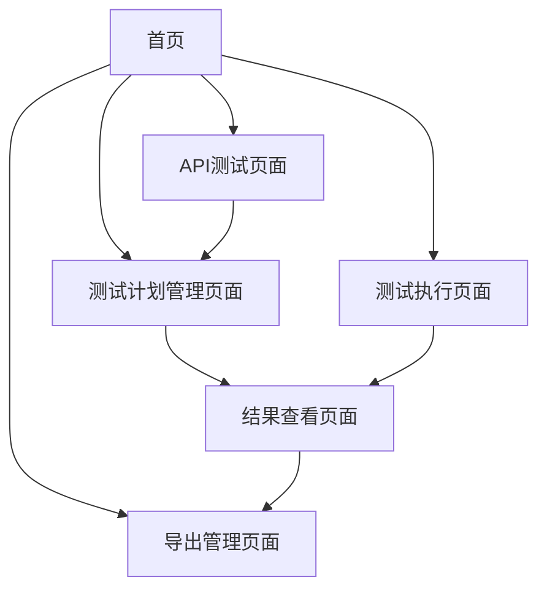

## 1. Product Overview
API测试管理系统是一个基于Hono框架的Web应用，将现有的FastMCP功能转换为用户友好的网页界面。系统提供API测试、测试计划管理、批量执行和结果导出等核心功能，采用简洁的黑白配色方案，为开发者提供高效的API测试解决方案。

## 2. Core Features

### 2.1 User Roles
本系统采用单用户模式，无需复杂的权限管理：

| Role | Registration Method | Core Permissions |
|------|---------------------|------------------|
| 默认用户 | 直接访问 | 可使用所有API测试和管理功能 |

### 2.2 Feature Module
我们的API测试管理系统包含以下主要页面：
1. **首页**：系统介绍、功能导航、快速操作入口
2. **API测试页面**：单个API测试功能，支持各种HTTP方法和参数配置
3. **测试计划管理页面**：创建、查看、编辑测试计划和任务
4. **测试执行页面**：批量执行测试任务，实时显示执行结果
5. **结果查看页面**：查看测试结果详情，支持编辑总结和建议
6. **导出管理页面**：将测试结果导出为Excel文件

### 2.3 Page Details

| Page Name | Module Name | Feature description |
|-----------|-------------|---------------------|
| 首页 | Hero区域 | 显示系统标题、描述和主要功能入口按钮 |
| 首页 | 功能导航 | 网格布局展示各功能模块卡片，支持快速跳转 |
| API测试页面 | 请求配置 | 配置URL、HTTP方法、查询参数、请求头、请求体 |
| API测试页面 | 结果显示 | 展示响应状态码、响应头、响应体等详细信息 |
| 测试计划管理页面 | 计划列表 | 显示所有测试计划，支持查看、编辑、删除操作 |
| 测试计划管理页面 | 计划创建 | 创建新测试计划，添加多个测试任务 |
| 测试计划管理页面 | 任务管理 | 查看计划下的所有任务，支持编辑和删除 |
| 测试执行页面 | 批量执行 | 选择测试计划并执行所有任务 |
| 测试执行页面 | 进度显示 | 实时显示执行进度和状态 |
| 结果查看页面 | 结果列表 | 展示测试结果，包括成功/失败状态 |
| 结果查看页面 | 详情编辑 | 编辑测试总结和建议，标记任务完成状态 |
| 导出管理页面 | 文件导出 | 选择测试计划导出Excel格式的测试报告 |

## 3. Core Process

用户主要操作流程如下：
1. 访问首页，了解系统功能并选择所需操作
2. 进行单个API测试：配置请求参数 → 发送请求 → 查看结果
3. 管理测试计划：创建计划 → 添加任务 → 编辑任务详情
4. 执行批量测试：选择计划 → 执行测试 → 查看结果
5. 结果管理：查看详情 → 编辑总结 → 导出报告

## 4. User Interface Design

### 4.1 Design Style
- **主色调**：黑白对比设计，背景色为白色(#ffffff)，文字色为黑色(#171717)
- **字体**：Arial, Helvetica, sans-serif字体栈，标题使用粗体
- **按钮样式**：圆角设计，悬停时带有动画效果
- **布局风格**：网格布局，卡片式设计，简洁无装饰
- **图标样式**：使用SVG图标，保持简洁风格
- **支持暗黑模式**：自动切换功能

### 4.2 Page Design Overview

| Page Name | Module Name | UI Elements |
|-----------|-------------|-------------|
| 首页 | Hero区域 | 6xl字号大标题，xl字号副标题，lg字号描述文字，居中布局 |
| 首页 | 功能导航 | 网格布局卡片，圆角边框，悬停效果带边框颜色变化和阴影 |
| API测试页面 | 请求配置 | 表单布局，输入框和下拉选择器，圆角边框样式 |
| API测试页面 | 结果显示 | 代码块样式展示JSON响应，语法高亮 |
| 测试计划管理页面 | 计划列表 | 表格布局，行悬停效果，操作按钮组 |
| 测试计划管理页面 | 任务管理 | 可展开的任务列表，编辑表单弹窗 |
| 测试执行页面 | 进度显示 | 进度条组件，状态指示器，实时更新 |
| 结果查看页面 | 结果列表 | 卡片布局，状态标签，详情展开 |
| 导出管理页面 | 文件导出 | 选择器和下载按钮，文件状态提示 |

### 4.3 Responsiveness
系统采用桌面优先设计，支持移动端自适应布局，考虑触摸交互优化。自定义滚动条样式，宽度8px，轨道和滑块使用不同颜色区分。