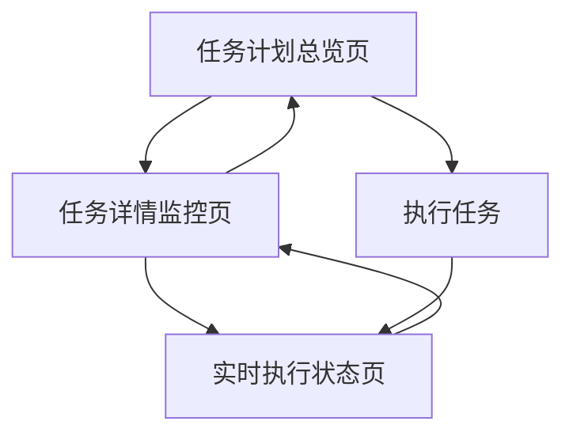

## 1. Product Overview
任务执行监控系统是一个基于现有API测试基础设施的可视化监控平台。系统将FastMCP的后端功能转换为直观的Web界面，专注于实时展示测试计划和任务的执行状态。采用简洁的黑白配色设计，为开发者和测试人员提供高效的任务监控解决方案。

系统基于JSON文件数据库，管理测试计划(TestTable)和测试任务(TestTask)的完整生命周期，从创建、执行到结果分析的全流程可视化。

## 2. Core Features

### 2.1 User Roles
本系统采用单用户模式，专注于监控功能：

| Role | Registration Method | Core Permissions |
|------|---------------------|------------------|
| 监控用户 | 直接访问 | 查看所有任务状态、执行详情、结果分析 |

### 2.2 Feature Module
我们的任务执行监控系统包含以下核心页面：
1. **任务计划总览页**：展示所有测试计划列表，包含状态统计和快速操作
2. **任务详情监控页**：深入查看单个测试计划下的所有任务执行情况
3. **实时执行状态页**：监控任务执行过程中的实时状态变化

### 2.3 Page Details

| Page Name | Module Name | Feature description |
|-----------|-------------|---------------------|
| 任务计划总览页 | 计划列表展示 | 显示所有测试计划，包含名称、创建时间、任务数量、完成状态 |
| 任务计划总览页 | 状态统计面板 | 展示系统整体统计：总计划数、总任务数、完成率、执行中任务数 |
| 任务计划总览页 | 快速操作区 | 提供计划执行、刷新状态、查看详情等快速操作按钮 |
| 任务详情监控页 | 计划信息头部 | 显示选中计划的基本信息：名称、UUID、创建时间、更新时间 |
| 任务详情监控页 | 任务列表展示 | 展示计划下所有任务，包含任务名称、HTTP方法、URL、执行状态 |
| 任务详情监控页 | 任务状态指示器 | 使用颜色和图标直观显示任务状态：待执行、执行中、成功、失败 |
| 任务详情监控页 | 执行结果查看 | 展示任务执行结果：响应状态码、响应时间、响应内容预览 |
| 任务详情监控页 | 任务配置信息 | 显示任务的详细配置：请求参数、请求头、请求体、期望结果 |
| 实时执行状态页 | 执行进度条 | 实时显示当前执行进度和剩余任务数量 |
| 实时执行状态页 | 执行日志流 | 实时滚动显示任务执行日志和状态变化 |
| 实时执行状态页 | 结果统计图表 | 动态更新成功/失败任务统计图表 |

## 3. Core Process

用户主要操作流程：
1. 访问任务计划总览页，查看所有测试计划的整体状态
2. 点击特定计划，进入任务详情监控页查看具体任务执行情况
3. 通过实时执行状态页监控正在执行的任务进度
4. 查看任务执行结果和详细的响应信息
5. 分析任务执行统计数据和趋势

## 4. User Interface Design

### 4.1 Design Style
- **主色调**：黑白对比设计，背景色为白色(#ffffff)，文字色为黑色(#171717)
- **状态色彩**：
  - 待执行：灰色(#6b7280)
  - 执行中：蓝色(#3b82f6)
  - 成功：绿色(#10b981)
  - 失败：红色(#ef4444)
- **字体**：Arial, Helvetica, sans-serif字体栈，标题使用粗体
- **按钮样式**：圆角设计，悬停时带有动画效果
- **布局风格**：卡片式设计，网格布局，简洁无装饰
- **图标样式**：使用SVG图标，状态指示器采用圆点或图标形式

### 4.2 Page Design Overview

| Page Name | Module Name | UI Elements |
|-----------|-------------|-------------|
| 任务计划总览页 | 状态统计面板 | 4个统计卡片，圆角边框，数字大字体显示，副标题说明 |
| 任务计划总览页 | 计划列表展示 | 表格布局，行悬停效果，状态标签，操作按钮组 |
| 任务详情监控页 | 计划信息头部 | 面包屑导航，计划名称大标题，元信息小字体显示 |
| 任务详情监控页 | 任务列表展示 | 卡片网格布局，每个任务一个卡片，状态圆点指示器 |
| 任务详情监控页 | 执行结果查看 | 可展开的详情面板，代码块样式显示JSON响应 |
| 实时执行状态页 | 执行进度条 | 动画进度条，百分比显示，剩余时间估算 |
| 实时执行状态页 | 执行日志流 | 滚动容器，等宽字体，时间戳前缀，颜色区分日志级别 |
| 实时执行状态页 | 结果统计图表 | 简单的饼图或柱状图，实时更新数据 |

### 4.3 Responsiveness
系统采用桌面优先设计，支持移动端自适应布局。任务列表在移动端采用垂直堆叠布局，状态统计面板在小屏幕上调整为2x2网格。

## 5. Data Structure

### 5.1 核心数据模型

**TestTable (测试计划)**
- uuid: 唯一标识符
- name: 计划名称
- status: 计划状态 (boolean)
- isFinish: 是否完成 (boolean)
- createTime: 创建时间
- updatedAt: 更新时间

**TestTask (测试任务)**
- uuid: 唯一标识符
- testTableUuid: 所属计划ID
- name: 任务名称
- url: 请求URL
- method: HTTP方法
- query: 查询参数 (可选)
- headers: 请求头 (可选)
- body: 请求体 (可选)
- hopeRes: 期望结果
- res: 实际响应结果 (可选)
- review: 任务总结 (可选)
- suggest: 建议 (可选)
- isFinish: 是否完成
- status: 任务状态
- createTime: 创建时间
- updatedAt: 更新时间

### 5.2 状态定义

**任务执行状态**
- 待执行：isFinish=false, res=undefined
- 执行中：正在调用API的过程中
- 执行成功：isFinish=true, status=true, res有值
- 执行失败：isFinish=true, status=false, res包含错误信息

**计划完成状态**
- 未开始：所有任务都是待执行状态
- 执行中：部分任务已完成，部分任务待执行
- 已完成：所有任务都已执行完成

## 6. API Integration

系统将复用现有的FastMCP工具接口：
- get-test-plans: 获取所有测试计划或指定计划的任务
- execute-test-plan: 执行指定测试计划
- update-task: 更新任务状态和结果
- batch-update-task-summaries: 批量更新任务总结

前端通过HTTP API调用这些MCP工具，实现数据的实时获取和更新。